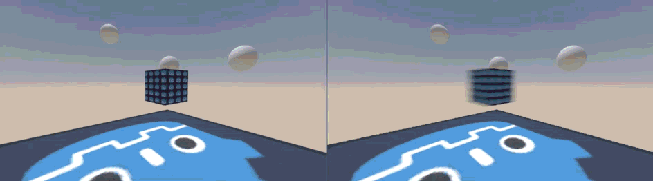
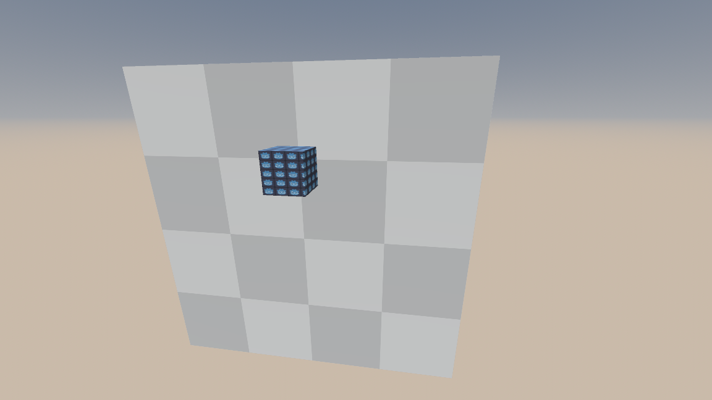
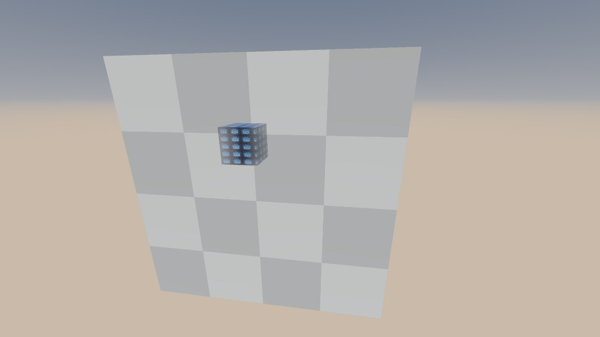
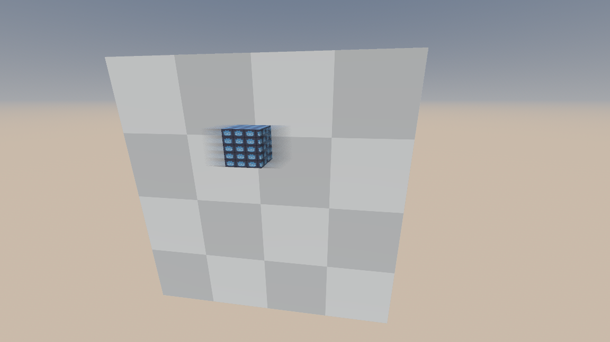
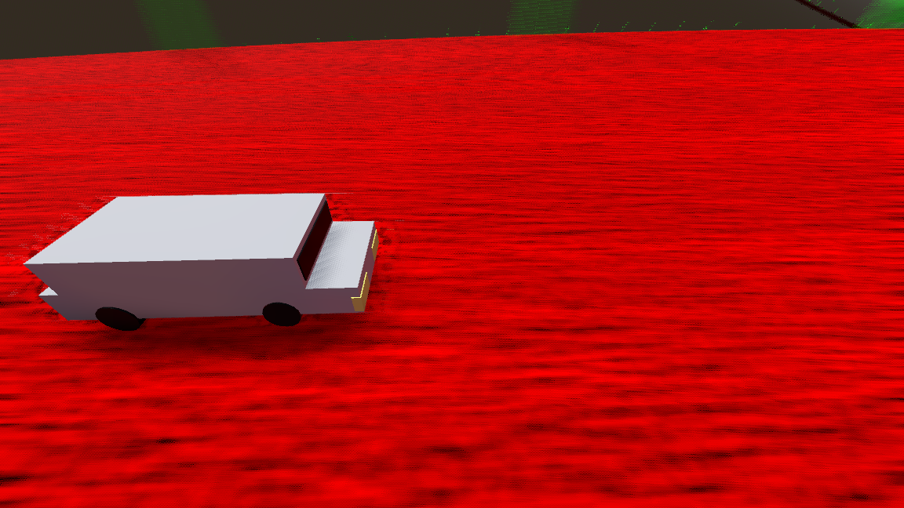
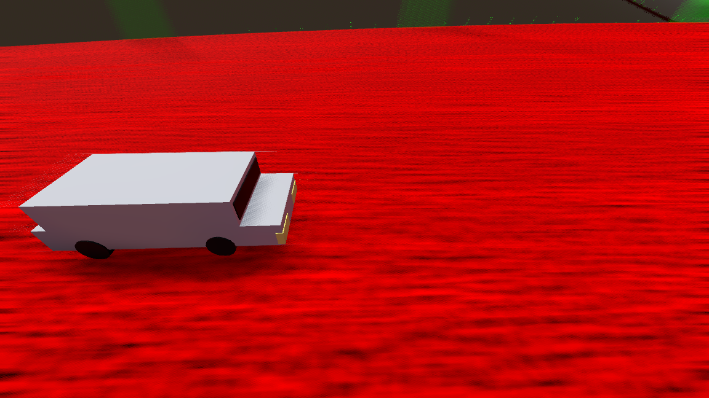

# Godot Motion Blur Addon
The latest iteration of my motion blur implementation for godot, including a technical walkthrough.

Table of contents:

- [**Guide**](#guide)

- [**Background**](#background)

- [**Technical Overview**](#technical-overview)
    - [What Is Motion Blur](#what-is-motion-blur)
    - [Real-Time Post-Process Motion Blur is Different](#real-time-post-process-motion-blur-is-different)
    - [Godot's limitaions](#godots-limitations)
    - [Z Velocities](#z-velocities)
    - [Centered Blur](#centered-blur)
    - [Taking Centered Blur a Step Further](#taking-centered-blur-a-step-further)
    - [The Pipeline](#the-pipeline)
    - **Stages**:
        - [Pre Processing Stage](#pre-processing-stage)
        - [Tile Max X Stage](#tile-max-x-stage)
        - [Tile Max Y Stage](#tile-max-y-stage)
        - [Neighbor Max Stage](#neighbor-max-stage)
        - [Motion Blur Stage](#motion-blur-stage)
- [**Sources**](#sources)

## Guide

### Installation
1. Install the [Easy Compositor Addon](https://github.com/sphynx-owner/Easy-Compositor-Addon), it's a dependency.
2. Download the code as a zip file (or download the latest release if there's any).
3. Copy the folder `./addons/godot-motion-blur` and paste it under `res://addons/` in your Godot project.
4. Go to **Project**->**Project Settings**->**Plugins** and ensure that the *Godot Motion Blur* plugin is enabled.

### How To Use
1. Add a **GuertinSphynxMotionBlur** compositor effect to your active compositor. It should start working right away.

### Additional Features
To be written

## Background

Disclaimer: You can skip this section and jump straight to **Technical Overview**.

A few years back the Godot development team reached out to the community to create a workgroup that would develop Godot's motion blur.

I was already very interested in graphics programming so with limited experience I joined the task force.

I ended up finding a cool way to dilate dominant velocities for motion blur, and sadly fixated on it for way too long. Later I realized that velocity dilation is far from what makes a motion blur effect great.

I then compiled a few different motion blur implementations for godot together to create the very messy [JFA driven motion blur addon](https://github.com/sphynx-owner/JFA_driven_motion_blur_addon) repository.

It was pretty popular and is still a go to for people who want to add motion blur in their Godot projects.

A year or so pass, and efforts to add the motion blur natively to Godot were rejuvinated. People volunteered and needed a reference to work with and migrate natively into Godot.

The existing motion blur repository was not approachable for that purpose, so with limited time I compiled the [godot motion blur addon simplified](https://github.com/sphynx-owner/godot-motion-blur-addon-simplified) repository.

It was an improvement over the previous repo, cleaned up, fat trimmed, and only contained the desired motion blur pipeline. However, it could have been better. [**@HydrogenC**](https://github.com/HydrogenC) and [**@DaveTheEggMan**](https://github.com/DaveTheEggman) rolled with it and created an amazing native Godot implementation of it in [this PR](https://github.com/godotengine/godot/pull/115027).

Due to my limited time I could not focus as much as I would have liked on polishing the effect, so when the time came to consider merging it, it fell short.

Recently, however, I was able to allocate the appropriate time and effort to this project.

Over the past few weeks I've developed a suite of tools to help iterate, benchmark, and showcase the motion blur with relative ease.

At the time of writing this, the motion blur is nearly unrecognizeable compared to when I started. Better in many ways.

This repo aims to be a reference for engine maintainers in hopes of proving its feasibility as a native engine feature. If it does not end up achieving that, it could be the new-and-improved motion blur addon for Godot.

## Technical Overview

### What Is Motion Blur

I am not qualified to discuss real-world phenomenon like camera blur or the blur perceived by our eyes and brain. The definition I will go with is simple yet solid enough for our purposes:

Motion blur is an artifact resulting from **the averaging of perceived light over a period of time**.

[](readme_assets/blur_accumulation.mp4)

The gif above shows the process of averaging the scene's color over time as objects move through it, and the resulting emergence of motion blur as we know it.


### Real-Time Post-Process Motion Blur is Different

A practical real-time motion blur effect does not have the luxury of averaging the color of a scene at multiple points in time, as it would require multiple render passes. Instead we slightly skew our definition of motion blur, to be from the perspective of the viewed elements.

Instead of saying that motion blur is the average of color over a period of time, we can say that it's the smearing and dilution (losing opacity) of objects along their motion over a period of time.

Let's say this is our input (the cube is moving to the left):



The way this motion blur works can be separated into 3 distinct-yet-complementary layers:

1. ***Smearing the current object's color*** - Using the velocities directly written by the current object, we can scavange for similar-depth pixels that match in velocity, assume they belong to the same current object, and avegrage the color using them. Since it's using the object's velocities, it's confined to the current object's silhouette.


1. ***faking the current object's transparency*** - Using the velocities directly written by the current object we can also scavange for background geometry (geometry that's further from the camera than the current object), and collect color from it to create this sort of camouflaging effect. Since the object is at motion, and is going to be covered by the next layer, this usually goes unnoticed. This works especially well against simple backgrounds or backgrounds with geometry that flows with the motion. This layer is also confined to the object's silhouette.


2. ***Accepting the extended blur of other objects*** - This requires some form of velocity dilation, which extends dominant velocities in the velocity texture beyond their original silhouettes. The dilated velocities are then used to "search" for objects that match them in their velocity and are closer to the camera than the current object. We then blur these objects onto the current object. In this example, the back wall sees dominant velocities from the cube, and collects color from it onto itself.


When designed to naturally complete each other, combining the 3 layers results in a seamless and believable approximation.


### Godot's limitations

Godot provides us with a motion-vectors texture, and it's not without its caveats:

- Motion vectors are actually not motion vectors. They are the screen UV change of objects from the last frame. To actually use them as velocities, we have to negate them.
- The user has no control over them, so they cannot be selectively disabled or enabled for individual meshes (custom motion vector support is in the works).
- Motion vectors are not written for background and skyboxes.
- Some render settings like enabling FSR2 drastically modify how these motion vectors behave.
- As of now there are glitches with objects that are spawned in, and sharp direction changes of the camera movement.
- If the camera moves backwards really fast along a surface, you can see velocity vectors that point to a position behind the camera's near clip plane. This leads to these velocities being flipped, and in addition results in asymptotical behavior the closer these previos positions are to the near clip plane.

I am solving some of these issues in this addon.

### Z Velocities

As described in [this section](#real-time-post-process-motion-blur-is-different), The depth of objects matter in how they are blurred. Objects smear their own color and the color of any objects further than them, and they accept the color of dominant-velocity objects that are in front of them.

Most standard motion blur implementations use the xy channels to store velocity onto a texture. It works very well, but the lack of z velocity information (how fast the object moves towards or away from the camera) can lead to unwanted artifacts in scenarios where these velocities are dominant.

Such scenarios can be commonly found in racing games. Considering that the racing game genre is amongst the most valid genres to apply motion blur to, it makes accounting for such artifacts a worthy task.

It's common in racing games to follow a car with the camera from the front, and see the road disappear underneath it.

If we only use the xy velocity of the road (it's screen UV change), we can only use the static depth information from the depth texture to compare against the car.

This means that the portion of the road that's in front of the car is treated as if it moves upwards in 2 dimensions. Since it's closer to the camera than the car is, the car thinks it should accept that road as a foreground, dominant-velocity object, blurring it on top. From the road's perspective because it is in front of the car, it treats the car as background, and adds color from it to fake its own transparency.

The resulting artifacts can look like this:


If we have the z component of the velocity, we can use it when testing the depth of the road, so by the time samples reach the car they are also aware of how much further they are from the camera, and thus behind the car.

The car also knows that by the time it's dominant-velocity sampling reaches the road, that road is further away behind it, and it does not sample from it.

This improves visual robustness:


### Centered Blur

An aspect to consider when implementing motion blur, is the offset along the velocity in which we blur.

The industry standard is of a *centered* approach, where you start blurring from half a velocity before the object, all the way to half a velocity past the object. The result is that the object is blurred equally in both directions, hence it is "centered".

You can see this behavior in the example of [a previous section](#real-time-post-process-motion-blur-is-different).

Engines like Unreal Engine provide tangential velocities in its velcoity texture, derived from the object's linear and angular velocity values. They work well with centered blur, as tangent velocities estimate the object's actual trajectory equally well both forwards and backwards.

However, Godot's velocity texture is just a UV-change texture, the value at each pixel points to it's past screen UV.

This means that the "most correct' blurring in godot would happen *fully backwards* in time, bridging the object to its past position.

But it should **never** be done.

This has been a pitfall I was trapped in when I first started developing the motion blur effect. It made sense as blur appeared to "overshoot" less that way.

But the costs of committing to backwards blurring revealed to dwarf the trajectory-estimation accuracy benefit.

Here are the crucial benefits that make centered blurring non-negotiable:

1. Reduces velocity dilation magnitude requirements by half, since the resulting blur's magnitude is half of the velocity magnitude. This reason alone is already enough. It meant that novel velocity dilation methods like the jump flood technique I created were absolutely overkill compared to the industry standard tile-based approaches, rendering it obsolete.

2. Dilating velocities and performing the blur is greatly simplified since we don't need to perform directionality checks as much. Whether the velocity is towards or away from us is equivalent in many cases.

3. You don't have to fake transparency of objects as much, and the faked transparency portion is better hidden in the middle of the blur, instead of sticking out like a sore thumb at the edge of it. This alone is also enough of a reason. The improvement in visual robustness is significant.

4. Dilated velocities work in both direction, so if objects move in opposite directions the same dilated velocity can take care of extending the blur for both objects. Another crucial improvement to visual robustness.

### Taking Centered Blur a Step Further

Industry standard motion blur implementations run their sampling processes from one end of the offset velocity range, to the other. So most commonly you will see implementations that start at an offset of `-0.5 * velocity`, and finish at `0.5 * velocity`, sampling at regular intervals along that range.

What happens when there's nothing for the blur to work with?

The motion blur effect falls short at the lack of information. A common place where that can happen is when objects move and disappear behind stationary geometry.

At that point, the color-smearing process cannot pick color from foreground geometry onto itself, and the blur visibly reduces towards the cutoff.

In this example, you can see the details being less blurred against edges of foreground geometry, as well as the edges of the screen:



To solve this, we can leverage the fact we are sampling in both directions, and reuse samples from the exposed direction instead of cutting samples off:



To pull this off, the motion blur samples in *both directions at the same time*, starting from the middle.

This means that we can iterate half as much, as we do double the sampling in each iteration.

The reason this requires sampling in both directions at the same time, is to maintain the color weight distribution. Trying other solutions like reusing old samples in the accumulated color sum could lead to color inaccuracy.

### The Pipeline

This is the motion blur pipeline:


It uses the scene data buffer and the depth, velocity and color textures provided by Godot. In addition it uses a texture to store custom processed velocities and depth, 2 textures to generate neighbor_max information and an output color texture.

There are 5 compute stages in the pipeline:

1. **Pre Processing** - Takes the depth and velocity textures, as well as scene data, and Generates a processed velocity-depth texture. It's most crucial functionality is adding motion vectors to background pixels.

2. **Tile Max X** - Finds and stores the largest velocity in each tile's row.

3. **Tile Max Y** - Takes the result of Tile Max X, and performs a similar process, now vertically, resulting in a pixel-per-tile texture of the largest velocity found in each tile (Tile Max).

4. **Neighbor Max** - Takes the Tile Max texture, and output a Neighbor Max texture, each pixel now containing the largest velocity found in each tile and its neighbors.

5. **Motion Blur** - Takes the Neighbor Max texture, the processed velocitiy-depth texture, and Godot's color texture, and generates a motion blur approximation onto a Color Output texture.

The pipeline uses Godot's depth, color and velocity textures, and 4 additional custom textures:

1. **processed velocity-depth** `rgba16f | size = (render_size.x, render_size.y)` - stores the result of the Pre Processing stage.

2. **tile max x / neighbor max** `rg8i | size = (render_size.x / tile_size, render_size.y)` - stores both the result of the Tile Max X stage, and then used again to store the result of the Neighbor Max stage. 

3. **tile max** `rg8i | size = (render_size.x / tile_size, render_size.y / tile_size)` - stores the result of the Tile Max Y stage.

4. **color output** `rgba16f | size = (render_size.x, render_size.y)` - stores the output of the Motion Blur stage

### Pre Processing Stage

The implementation of this stage with detailed comments throughout can be found in [pre_blur_processor.glsl](<addons/godot-motion-blur/pre_blur_processing/shader_stages/pre_blur_processor.glsl>).

#### Purpose

The main purpose of this stage is to generate missing information, specifically velocity infomration for background pixels. 

In the current implementation, this stage is also in charge of other nice-to-have features:

* It transforms velocities to be in pixel space.
* It separates motion vectors into separate components attributed to camera motion, camera rotation, and object motion, and allows tuning them separately.
* It fixes broken velocities when FSR2 is enabled.
* It fixes broken velocities when the camera moves backwards very fast.
* It clamps velocities' length to be no larger than the span of 2 tiles.
* It generate Z velocities (in view space) for static environment, and stores them in the blue channel.
* It stores depth in the alpha channel to be used with the generated Z velocities (one less texture sampling on the motion blur stage).

### Tile Max X Stage

The implementation of this stage can be found in [guertin_tile_max_x.glsl](<addons/godot-motion-blur/guertin/shader_stages/guertin_tile_max_x.glsl>).

#### Purpose

This is the first stage in the process of creating the **tile max** texture. The **tile max** texture has the largest velocity from each tile stored in per-tile pixels. This means we have to look up at `tlie_size^2` pixels for each tile to find the one with the largest velocity.

By dividing this lookup process to a horizontal pass, and then a vertical pass on the result in the following Tile Max Y stage, we reduce the complexity to linear, only running `tile_size * 2` synchronous operations in total.

So in this stage we are really performing a *tile row max* pass.

### Tile Max Y Stage

The implementation of this stage can be found in [guertin_tile_max_y.glsl](<addons/godot-motion-blur/guertin/shader_stages/guertin_tile_max_y.glsl>).

#### Purpose

Takes the resulting **tile max x** texture from the previous stage, and searches the single column of each tile for the largest velocity in that column, storing it into the **tile max** texture.

### Neighbor Max Stage

The implementation of this stage can be found in [guertin_neighbor_max.glsl](<addons/godot-motion-blur/guertin/shader_stages/guertin_neighbor_max.glsl>).

#### Purpose

This the velocity dilation stage. Dominant velocities are extended onto neighboring tiles.

#### Implementation Details

The implementation is pretty straight forward, except for the diagonal tile discarding logic.

The way it works is that it discards of diagonal tiles that the velocity could never reach.

```glsl
bool is_diagonal = i != 0 && j != 0;

vec2 current_neighbor_velocity = texelFetch(tile_max, current_uvi, 0).xy;

float current_neighbor_velocity_length = length(current_neighbor_velocity);

bool can_reach_tile = abs(dot(current_neighbor_velocity / max(1e-6, current_neighbor_velocity_length), current_offset / SQRT_2)) > COS_45;

if(is_diagonal && !can_reach_tile)
{
    continue;
}
```


### Motion Blur Stage

The implementation of this stage with detailed comments throughout can be found in [guertin_sphynx_blur.glsl](<addons/godot-motion-blur/guertin/shader_stages/guertin_sphynx_blur.glsl>).

#### Purpose

This stage generates the motion blur. It executes on the concepts described in [Real-Time Post-Process Motion Blur is Different](#real-time-post-process-motion-blur-is-different),
[Z Velocities](#z-velocities),
[Centered Blur](#centered-blur), and
[Taking Centered Blur a Step Further](#taking-centered-blur-a-step-further).

## Sources

1. [Call of Duty's post processing slideshow (interleaved gradient noise)](https://www.iryoku.com/next-generation-post-processing-in-call-of-duty-advanced-warfare/)

2. [demofox's blog discussing interleaved gradient noise](https://blog.demofox.org/2022/01/01/interleaved-gradient-noise-a-different-kind-of-low-discrepancy-sequence/)

3. [keyjiro's KinoMotion repo](https://github.com/keijiro/KinoMotion)

4. [JFA driven motion blur addon](https://github.com/sphynx-owner/JFA_driven_motion_blur_addon)

5. [godot motion blur addon simplified](https://github.com/sphynx-owner/godot-motion-blur-addon-simplified)

6. [Godot's motion blur pull request](https://github.com/godotengine/godot/pull/115027)