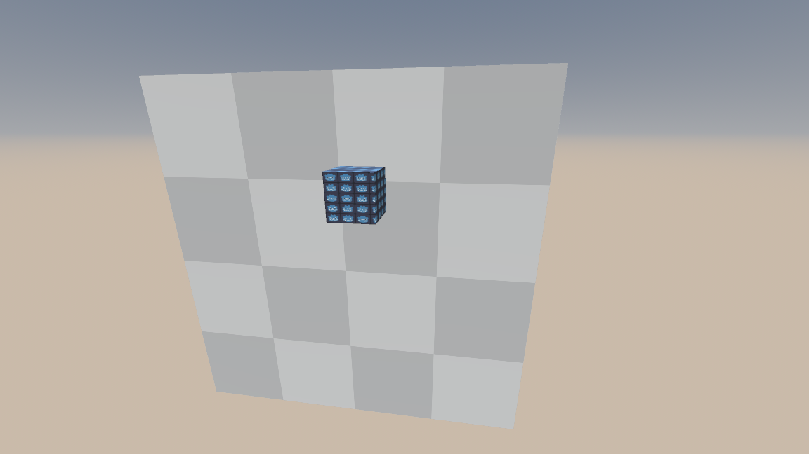
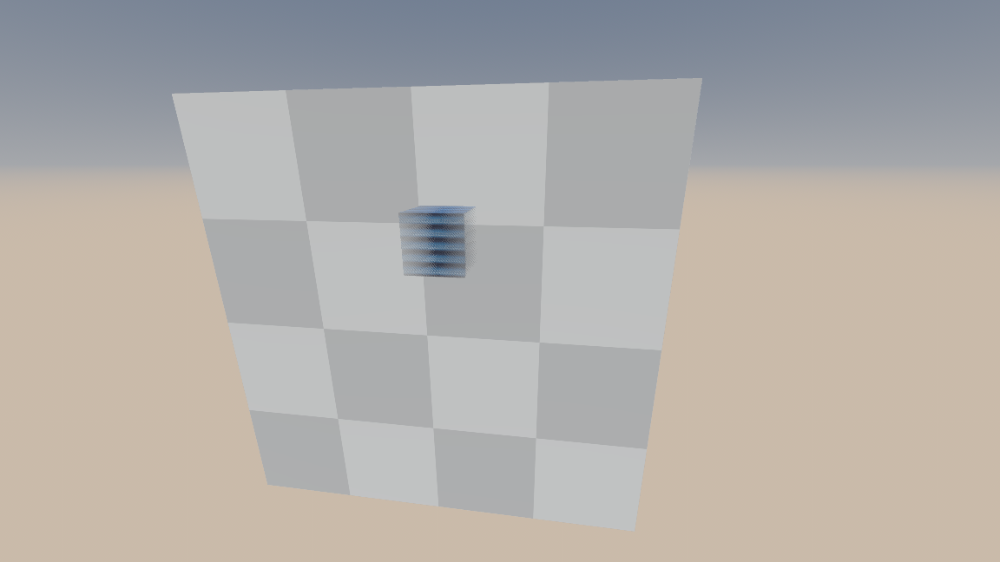
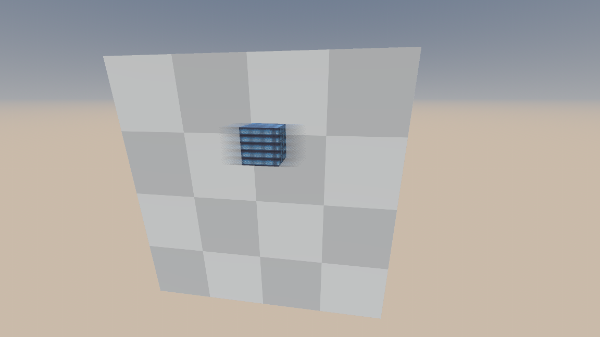
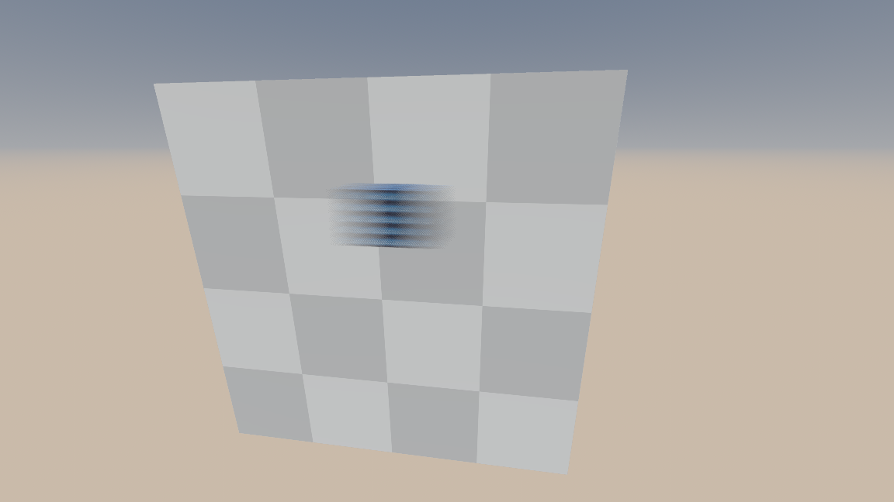
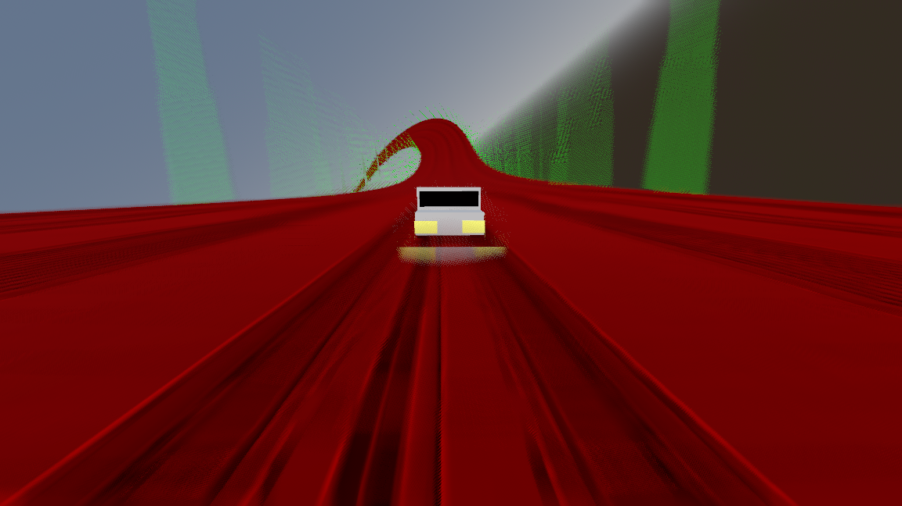
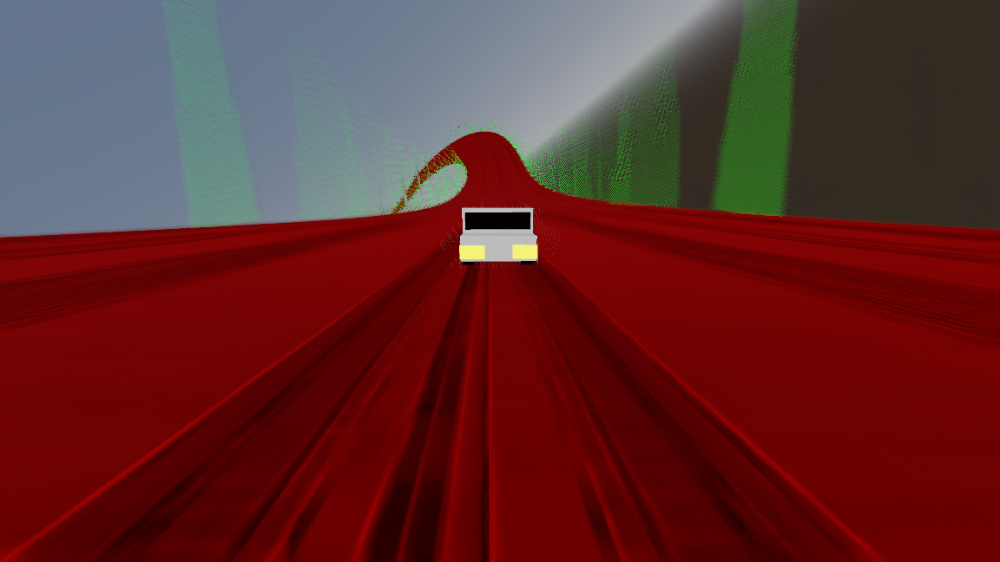
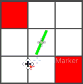

# Godot Motion Blur Addon
The latest iteration of my motion blur implementation for godot, including a technical walkthrough.

Table of contents:

- [**Guide**](#guide)

- [**Background**](#background)

- [**Technical Overview**](#technical-overview)
    - [What Is Motion Blur](#what-is-motion-blur)
    - [Real-Time Post-Process Motion Blur is Different](#real-time-post-process-motion-blur-is-different)
    - [Godot's limitaions](#godots-limitations)
    - [Z Velocities](#z-velocities)
    - [The Pipeline](#the-pipeline)
    - **Stages**:
        - [Pre Processing Stage](#pre-processing-stage)
        - [Tile Max X Stage](#tile-max-x-stage)
        - [Tile Max Y Stage](#tile-max-y-stage)
        - [Neighbor Max Stage](#neighbor-max-stage)
        - [Motion Blur Stage](#motion-blur-stage)

## Guide

### Installation
1. Install the [Easy Compositor Addon](https://github.com/sphynx-owner/Easy-Compositor-Addon), it's a dependency.
2. Download the code as a zip file (or download the latest release if there's any).
3. Copy the folder `./addons/godot-motion-blur` and paste it under `res://addons/` in your Godot project.
4. Go to **Project**->**Project Settings**->**Plugins** and ensure that the *Godot Motion Blur* plugin is enabled.

### How To Use
1. Add a **GuertinSphynxMotionBlur** compositor effect to your active compositor. It should start working right away.

### Additional Features
To be written

## Background

Disclaimer: You can skip this section and jump straight to **Technical Overview**.

A few years back the Godot development team reached out to the community to create a workgroup that would develop Godot's motion blur.

I enjoy the world of graphics programming, and with little experience and a lot of confidence, marched in to what I know today was a way-over-my-head task.

It was fun, don't get me wrong, but I simply was not equipped to be able to produce something that I could say Godot deserved.

I ended up finding a cool way to dilate velocities for motion blur, and fixated on it for way too long. Only later did I realize that velocity dilation is far from the only thing that makes a motion blur effect great.

Combine that with a relatively limited understanding of Godot (and programming in general), and you have the disasterously messy repository that's the [JFA driven motion blur addon](https://github.com/sphynx-owner/JFA_driven_motion_blur_addon) repo.

Nevertheless, it was pretty popular and is still a go to for people who want to add motion blur in their Godot projects.

A year or so pass, and efforts to add the motion blur natively to Godot were rejuvinated. This time it was serious, people were volunteering to take on it, and were asking technical questions.

The existing motion blur repository was not approachable for someone wanting to port it into the engine, so with the little time I had, I compiled the [godot motion blur addon simplified](https://github.com/sphynx-owner/godot-motion-blur-addon-simplified) repo.

It was a big improvement over the previous, more popular repo. The older repo was bloated with multiple motion blur methods that were not of interest, and everything was very ad-hoc, making it impossible to extract a coherent implementation out of.

This new repository was cleaned up, fat trimmed, and only contained the desired motion blur pipeline. But it could have been better. Still, [**@HydrogenC**](https://github.com/HydrogenC) and [**@DaveTheEggMan**](https://github.com/DaveTheEggman) rolled with it and created an amazing native Godot implementation of it in [this PR](https://github.com/godotengine/godot/pull/115027).

Due to lack of time I could not focus as much as I would have liked on polishing the effect, so when the time came to consider merging it, it fell short.

I now have some time, and this addon is the result.

Over the past few weeks I've developed a suite of tools to help me iterate on, benchmark, and showcase the motion blur with repeatability, reliability, and convenience.

The fruits of my labor have already payed off, and I was able to polish and optimize the effect further.

This repo aims to be a reference for engine maintainers in hopes of proving its feasibility as a native engine feature. If it does not end up achieving that, it could be the new-and-improved motion blur addon for Godot.

## Technical Overview

### What Is Motion Blur

Motion blur is an artifact resulting from **the averaging of perceived light over a period of time**.

<video controls src="readme_assets/blur_accumulation.mp4" title="Title"></video>

### Real-Time Post-Process Motion Blur is Different

A practical real-time motion blur effect does not have the luxury of averaging the color of a scene at multiple points in time, as it would require multiple render passes. Instead we slightly skew our definition of motion blur, to be from the perspective of the viewed elements.

Instead of saying that motion blur is the average of color over a period of time, we can say that it's the smearing and dilution (losing opacity) of objects along their motion over a period of time.

This is what the motion blur effect in this addon does.

Let's say this is our input:



You can mentally divide the way the real-time motion blur works into 2 distinct processes:

1. ***Smearing the current object's color*** - This uses the velocities directly written by the current object, so it's confined to the current object's silhouette. In addition to smearing the current object's color, it accepts any color from geometry that's further from the camera than the current object, achieving "fake transparency".


2. ***Accepting the extended blur of other objects*** - This requires some form of velocity dilation, which is the process of extending dominant velocities in the velocity texture beyond their original silhouettes. This dilated velocity texture is then used to "search" for objects that match that velocity and are closer to the camera than the current object, and blur them on top of it. In this example, the back wall sees dominant velocities from the cube, and collects color from it onto itself.


When designed to naturally complete each other, combining them results in a seamless and believable approximation.



### Godot's limitations

Godot provides us with a motion-vectors texture, and it's not without its caveats:

- The user has no control over them, so they cannot be selectively disabled or enabled for individual meshes (custom motion vector support is in the works).
- Motion vectors are not written for background and skyboxes
- Some render settings like enabling FSR2 modify how these motion vectors behave.
- Motion vectors are in UV space and in practice just point to the previous UV of the object.
- As of now there are glitches with objects that are spawned in, and sharp direction changes of the camera movement.
- If the camera moves backwards really fast along a surface, you can see velocity vectors that point to a position behind the camera's near clip plane. This leads to these velocities being flipped, and in addition results in asymptotical behavior the closer these previos positions are to the near clip plane.

I am solving some of these issues in this addon.

### Z Velocities

Most standard motion blur implementations use the xy channels to store velocity onto a texture. It works very well, but the lack of z velocity information (how fast the object moves towards or away from the camera) can lead to unwanted artifacts in scenarios where these velocities are dominant.

Such scenarios can be commonly found in racing games, where you can see the road disappear or appear from under a speeding car. Considering that the racing game genre is amongst the most valid genres to apply motion blur to, it makes accounting for such artifacts a worthy task.

As described in [this section](#real-time-post-process-motion-blur-is-different), The depth of objects matter in how they are blurred. Objects smear their own color and the color of any objects further than them, and they accept the color of dominant-velocity objects that are in front of them.

So what happens when something moves away from the camera, like the road under a speeding car?

If we only use the xy velocity of the road (it's perceived change), we can only use the static depth information from the depth texture to compare against the car.

This means that the portion of the road that's in front of the car is treated as if it moves upwards in 2 dimensions. Since it's closer to the camera than the car is, the car thinks it should accept that road as a foreground, dominant-velocity object, blurring it on top. From the road's perspective, it looks to smear its color, and because it is in front of the car, it treats the car as background, and adds color from it to fake its own transparency.

These artifacts look like this:



If we have the z component of the velocity, we can use it when testing the depth of the road, so by the time samples reach the car they are also aware of how much more further they are from the camera, and thus behind the car.

The car also knows that by the time it's dominant velocity sampling reaches the road, that road is further and further away from the camera, and it does not sample from it.

This is the result:



### The Pipeline

This is the motion blur pipeline:


It uses the scene data buffer and depth, velocity and color textures provided by Godot. In addition it uses a texture to store custom processed velocities and depth, 2 textures to generate neighbor_max information and an output color texture.

There are 5 compute stages in the pipeline:

1. **Pre Processing** - Takes the depth and velocity textures, as well as scene data, and Generates a processet velocity-depth texture with improved velocity and depth information. It's most crucial functionality is adding motion vectors to background pixels.

2. **Tile Max X** - Finds and stores the largest velocity in each tile's row.

3. **Tile Max Y** - Takes the result of Tile Max X, and performs a similar process, now vertically, resulting in a pixel-per-tile texture of the largest velocity found in each tile (Tile Max).

4. **Neighbor Max** - Takes the Tile Max texture, and output a Neighbor Max texture, each pixel now containing the largest velocity found in each tile and its neighbors.

5. **Motion Blur** - Takes the Neighbor Max texture, the processed velocitiy-depth texture, and Godot's color texture, and generates a motion blur approximation onto a Color Output texture.

The pipeline uses Godot's depth, color and velocity textures, and 4 additional custom textures:

1. **processed velocity-depth** `rgba16f | size = (render_size.x, render_size.y)` - stores the result of the Pre Processing stage.

2. **tile max x / neighbor max** `rg8i | size = (render_size.x / tile_size, render_size.y)` - stores both the result of the Tile Max X stage, and then used again to store the result of the Neighbor Max stage. 

3. **tile max** `rg8i | size = (render_size.x / tile_size, render_size.y / tile_size)` - stores the result of the Tile Max Y stage.

4. **color output** `rgba16f | size = (render_size.x, render_size.y)` - stores the output of the Motion Blur stage

### Pre Processing Stage

The implementation of this stage can be found in [pre_blur_processor.glsl](<addons\godot-motion-blur\pre_blur_processing\shader_stages\pre_blur_processor.glsl>).

#### Purpose

The main purpose of this stage is to generate missing information, specifically velocity infomration for background pixels. 

In the current implementation, this stage is also in charge of other nice-to-have features:

* It transforms velocities to be in pixel space instead of UV space.
* It separates motion vectors into separate components attributed to camera motion, camera rotation, and object motion, and allows tuning them separately.
* It fixes broken velocities when FSR2 is enabled.
* It fixes broken velocities when the camera moves backwards very fast.
* It clamps velocities to be no larger than 2 tiles.
* It repurposes the code that generates velocities for background pixels to also generate Z velocities (in view space) for static environment, and stores them in the blue channel.
* It stores view-space depth in the alpha channel to be used with the generated Z velocities.

#### Implementation Walkthrough

Godot provides scene information buffers that we can use inside compute shaders. Their struct starts like this.

```glsl
struct SceneData {
    mat4 projection_matrix;
    mat4 inv_projection_matrix;
    mat3x4 inv_view_matrix;
    mat3x4 view_matrix;
.
.
.
```

A key detail is that we get a similar struct containing information from the *previous frame*.

```glsl
layout(set = 0, binding = 3, std140) uniform SceneDataBlock {
	SceneData data;
	SceneData prev_data;
}
scene;
```

Using Godot's depth texture and the matrices in the scene data, we can convert the depth and UV of a pixel into a view position.

```glsl
float depth = texelFetch(depth_sampler, uvi, 0).x;

vec4 view_position = scene_data.inv_projection_matrix * vec4(uv_to_ndc(uvn), depth, 1.0);

view_position.xyz /= view_position.w;
```

We take the view position, transform it to a world position, and then back to a view position using the *previous view matrix*, resulting in an estimation of where the pixel was last frame in view space. This estimation only works for static environment. It breaks for moving objects.

```glsl
mat4 inv_view_matrix = view_mat3x4_to_mat4(scene_data.inv_view_matrix);

vec4 world_position = inv_view_matrix * vec4(view_position.xyz, 1.0);

mat4 prev_view_matrix = view_mat3x4_to_mat4(previous_scene_data.view_matrix);

vec4 view_past_position = prev_view_matrix * vec4(world_position.xyz, 1.0);
```

We extract a UV change (and an additional, view-space depth change component, which will be the z velocity).

```glsl
vec4 view_past_ndc = previous_scene_data.projection_matrix * view_past_position;

view_past_ndc.xyz /= view_past_ndc.w;

vec3 past_uv = vec3(ndc_to_uv(view_past_ndc.xy), view_past_position.z);

vec4 view_past_ndc_cache = view_past_ndc;

vec3 camera_uv_change = past_uv - vec3(uvn, view_position.z);
```

We do a similar process, but this time only using the rotation part of the view matrices, resulting in the part of the UV change that was caused by the rotation between frames.

```glsl
world_position = mat4(mat3(inv_view_matrix)) * vec4(view_position.xyz, 1.0);

view_past_position = mat4(mat3(prev_view_matrix)) * vec4(world_position.xyz, 1.0);

view_past_ndc = previous_scene_data.projection_matrix * view_past_position;

view_past_ndc.xyz /= view_past_ndc.w;

past_uv = vec3(ndc_to_uv(view_past_ndc.xy), view_past_position.z);

vec3 camera_rotation_uv_change = past_uv - vec3(uvn, view_position.z);
```

By subtracting the rotation part of the UV change from the total UV change, we can arriveat the UV change that was cause by the camera's movement.

```glsl
vec3 camera_movement_uv_change = camera_uv_change - camera_rotation_uv_change;
```

By subtracting the rotation part of the UV change from the total UV change, we can arrive at the UV change that was cause by the camera's movement.

```glsl
vec3 camera_movement_uv_change = camera_uv_change - camera_rotation_uv_change;
```

Get a velocity sample

```glsl
vec2 sampled_velocity = texelFetch(vector_sampler, uvi, 0).xy;
```

FSR2 alters the velocity buffer in a very specific way:

1. Static geometry has its velocity replaced with a vec2(-1).
2. Around the edges of moving geometry there are some pixels that have their velocities *divided by 2* and then added a vec2(-0.5).

The following code attempts to account for that, but it would  fail if valid velocities happen to land on these looked-for edge cases.

```glsl
if (params.support_fsr2 > 0.5) {
    if (sampled_velocity == vec2(-1)) {
        sampled_velocity = camera_uv_change.xy;
    }

    vec2 potential_replacement = (sampled_velocity + 0.5) * 2.0;

    if (dot(potential_replacement, potential_replacement) < dot(sampled_velocity, sampled_velocity)) {
        sampled_velocity = potential_replacement;
    }
}
```

In Godot, background and skyboxes do not write to the velocity buffer. However, our manually-extracted UV change uses the view-matrices and the depth buffer to generate equivalent velocities, and it works even when the depth is 0 (infinity/background). Assuming the skybox is always static (does not move on its own), the value we extracted can serve as the ground truth. We set the base velocity to that of the manually extracted vectors, and keep it if the depth is 0 (background depth). It's not currently possible, but in the future you may be able to write to the veolcity buffer without writing to the depth buffer, so I'm checking for non-zero velocity as well just to be safe.

```glsl
vec3 base_velocity = camera_uv_change;

if (dot(sampled_velocity * render_size, sampled_velocity * render_size) > PIXEL_RADIUS_SQUARED || depth > 0)
{
    base_velocity.xy = sampled_velocity;
}
```

By subtracting the "original" UV change stored on base_velocity from the manuall-derived camera UV change, we end up with the UV change that was caused by the object's motion

```glsl
vec3 object_uv_change = base_velocity - camera_uv_change.xyz;
```

Now that we have the 3 components that make the original motion vectors isolated, we can put them back together after tuning them however we like. We assume that component magnitudes are between 0 and 1. This must be enforced on the editor interface level.

```glsl
vec3 total_velocity = camera_rotation_uv_change * params.rotation_velocity_multiplier + camera_movement_uv_change * params.movement_velocity_multiplier + object_uv_change * params.object_velocity_multiplier;
```

If depth == 0 (skybox), or the objcet is not static (has some object uv change), clear z velocity. The z velocity was manually extracted using view matrices and thus can only be safely assumed for static environment. In the case of background pixels, it does not make much sense for them to have "depth velocity". In addition, the depth velocity of the background is very saturated since it's a point at infinity that covers large distances easily, and I worry about noise it might introduce.

```glsl
if (depth == 0 || dot(object_uv_change.xy, object_uv_change.xy) > 0.000001) {
    total_velocity.z = 0;
    base_velocity.z = 0;
}
```

This is a heuristic I came up with. Simply scaling down individual components of the original velocity can yield unintuivite results if those components are large but cancel out. For example, if a camera is following a speeding car, that car appears stationary in the camera's view, and so it's original velocity is small or zero. However under the hood that velocity is comprized of a very large object movement component on the car, cancelled out by the movement component of the camera that follows it. In that scenario, turning off just the object movement component would uncover that hidden camera movment component, and we would see the car start blurring more instead of less. The solution I stumbled across when trying to solve this issue has proven to be more robust than expected. The rule of thumb is that users that configure these velocity multipliers expect to REDUCE one or more aspects that otherwise trigger motion blur. So intuitively, the final velocity that decides the motion blur amount should be reduced or kept the same as the original velocity. Now, if all multipliers are set to lower than 1, we can  adjust our expectations and say that we expect the final velocity to be no larger than the largest configured multiplier multiplied by the original velocity. So if we have 0.2 object movment, 0.4 camera movement, and 0.1 camera rotation, we should not see any velocity that's larger than 0.4 of the original velocity.

```glsl
float max_component_multiplier = max(params.rotation_velocity_multiplier, max(params.movement_velocity_multiplier, params.object_velocity_multiplier));

vec3 fallback_velocity = base_velocity * max_component_multiplier;

if (length(total_velocity.xy) > length(fallback_velocity.xy)) {
    total_velocity = fallback_velocity;
}
```

Here is where the intensity parameter is applied, customized by the user.

```glsl
total_velocity *= params.motion_blur_intensity;
```

Here is where we apply the velocity thresholds, customized by the user.

```glsl
total_velocity *= sharp_step(
    params.velocity_lower_threshold,
    params.velocity_upper_threshold,
    length(total_velocity.xy)
);
```

From this point on we process the velocities for stability and robustness.

When the past ndc is behind the camera's near plane (or origin, not sure), the velocities asymptotally scale to infinity. This is a natural, undesirable behavior that occurs when the camera moves backwards rapidly. We tame these values by clamping their length to 1.

```glsl
clamp_length(total_velocity, total_velocity.xy, 1.0);
```

If the previous position is happening behind the camera, which can happen when the camera moves backwards at high speed, the w component of the projected vector would be negative, and the velocity vector would be flipped. This happens with Godot's native motion vectors as well. We can detect this and flip them back, avoiding crazy artifacts.

```glsl
total_velocity.xy = total_velocity.xy * render_size * (view_past_ndc_cache.w < 0 ? -1 : 1);
```

Now we clamp the velocity magnitudes to the tile size. This is a pretty important step that greatly improves stability and robustness. We mutliply the tile size by 2 here, because we blur the velocity symmetrically forwards and backwards, so it's radius is half its magnitude.

```glsl
float clamp_size = params.tile_size * 2;

clamp_length(total_velocity, total_velocity.xy, clamp_size);
```

If depth == 0 (skybox), view_position.z is -inf, which can also be arithmetically achieved with (-1.0 / 0.0).

```glsl
vec4 final_output = vec4(total_velocity, view_position.z);

imageStore(vector_output, uvi, final_output);
```

### Tile Max X Stage

The implementation of this stage can be found in [guertin_tile_max_x.glsl](<addons\godot-motion-blur\guertin\shader_stages\guertin_tile_max_x.glsl>).

#### Purpose

This is the first stage in the process of creating the **tile max** texture. The **tile max** texture has the largest velocity from each tile stored in per-tile pixels. This means we have to look up at `tlie_size^2` pixels for each tile to find the one with the largest velocity.

By dividing this lookup process to a horizontal pass, and then a vertical pass on the result in the following Tile Max Y stage, we reduce the complexity to linear, only running `tile_size * 2` synchronous operations in total.

So in this stage we are really performing a *tile row max* pass.

The implementation is pretty straight forward, a walkthrough is not necessary.

### Tile Max Y Stage

The implementation of this stage can be found in [guertin_tile_max_y.glsl](<addons\godot-motion-blur\guertin\shader_stages\guertin_tile_max_y.glsl>).

#### Purpose

Takes the resulting **tile max x** texture from the previous stage, and searches the single column of each tile for the largest velocity in that column, storing it into the **tile max** texture.

### Neighbor Max Stage

The implementation of this stage can be found in [guertin_neighbor_max.glsl](<addons\godot-motion-blur\guertin\shader_stages\guertin_neighbor_max.glsl>).

#### Purpose

This the velocity dilation stage. Dominant velocities are extended onto neighboring tiles.

#### Implementation Details

The implementation is also pretty straight forward, except for the diagonal tile discarding logic.

The way it works is that it discards of diagonal tiles that the velocity could never reach.

```glsl
bool is_diagonal = i != 0 && j != 0;

vec2 current_neighbor_velocity = texelFetch(tile_max, current_uvi, 0).xy;

float current_neighbor_velocity_length = length(current_neighbor_velocity);

bool can_reach_tile = abs(dot(current_neighbor_velocity / max(1e-6, current_neighbor_velocity_length), current_offset / SQRT_2)) > COS_45;

if(is_diagonal && !can_reach_tile)
{
    continue;
}
```

### Motion Blur Stage

The implementation of this stage can be found in [guertin_sphynx_blur.glsl](<addons\godot-motion-blur\guertin\shader_stages\guertin_sphynx_blur.glsl>).

#### Purpose

This stage generates the motion blur.

#### Implementation Walkthrough

